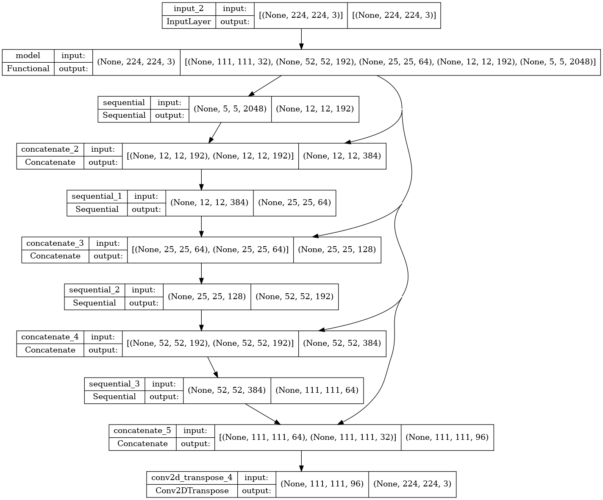
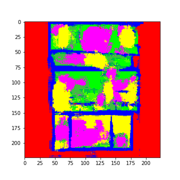
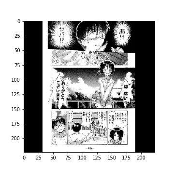

# manga_panel_segmentation
manga panel segmentation using unet

inceptionV3-based Unet was designed and trained on manga109-s dataset

## TODO
  * increase resolution of model or split input dataset
  * handle trapezoidal frames and speech bubble when generating dataset
  * add dropouts to the model

## Model performance
model structure : see model.png
  * 7742 pages for training
  * 860 pages for testing

### Demo
<!--  -->
Frame detection is too sensitive

### Accuracy

## Reference

> DeepPanel : https://github.com/pedrovgs/DeepPanel

> Matsui, Yusuke, Kota Ito, Yuji Aramaki, Azuma Fujimoto, Toru Ogawa, Toshihiko Yamasaki, and Kiyoharu Aizawa. "Sketch-based manga retrieval using manga109 dataset." Multimedia Tools and Applications 76, no. 20 (2017): 21811-21838.

> Aizawa, Kiyoharu, Azuma Fujimoto, Atsushi Otsubo, Toru Ogawa, Yusuke Matsui, Koki Tsubota, and Hikaru Ikuta. "Building a manga dataset “manga109” with annotations for multimedia applications." IEEE MultiMedia 27, no. 2 (2020): 8-18.

> Fujimoto, Azuma, Toru Ogawa, Kazuyoshi Yamamoto, Yusuke Matsui, Toshihiko Yamasaki, and Kiyoharu Aizawa. "Manga109 dataset and creation of metadata." In Proceedings of the 1st international workshop on comics analysis, processing and understanding, pp. 1-5. 2016.